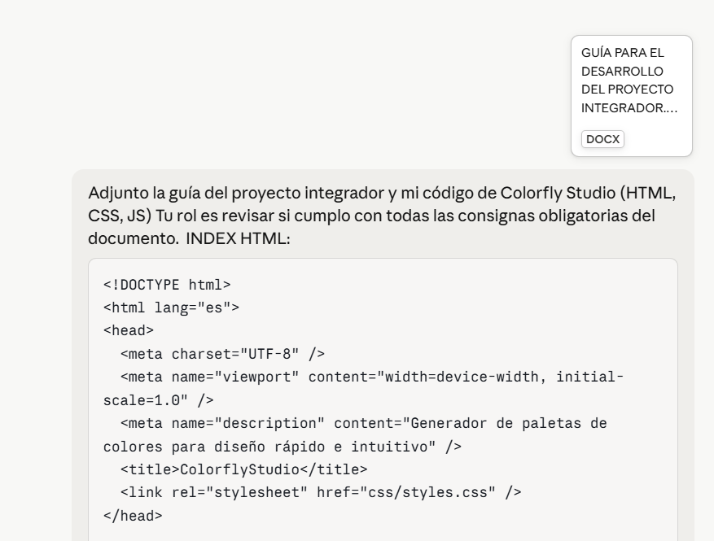
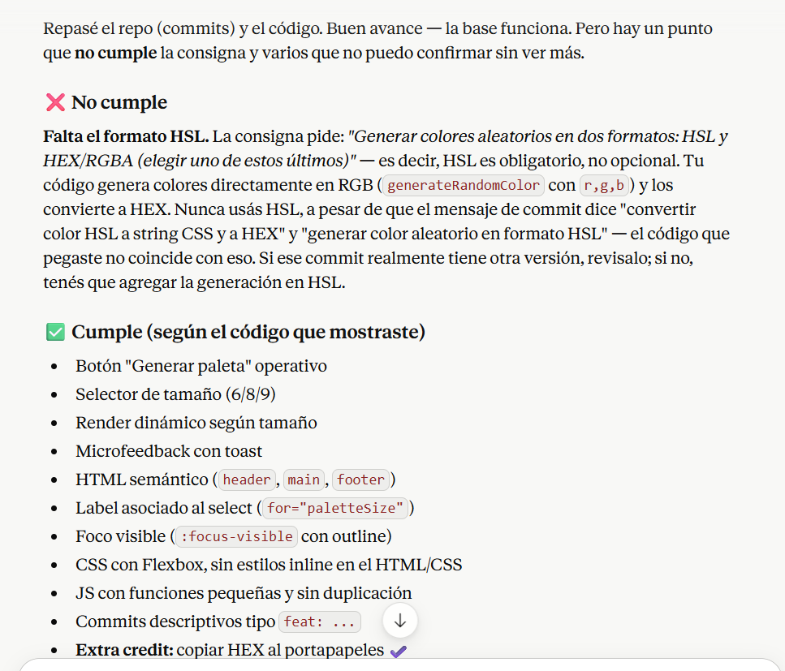
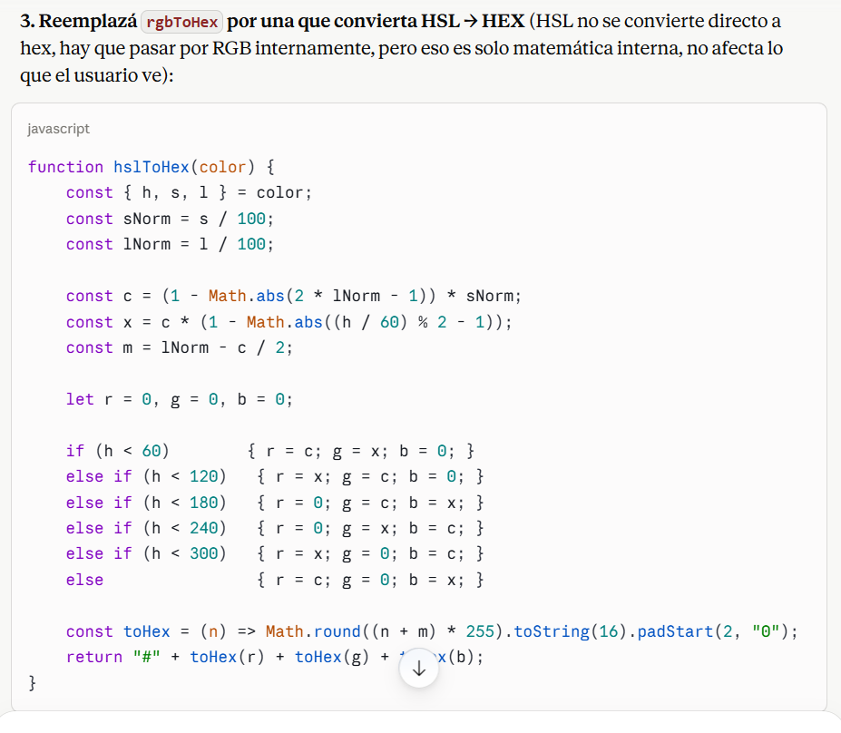
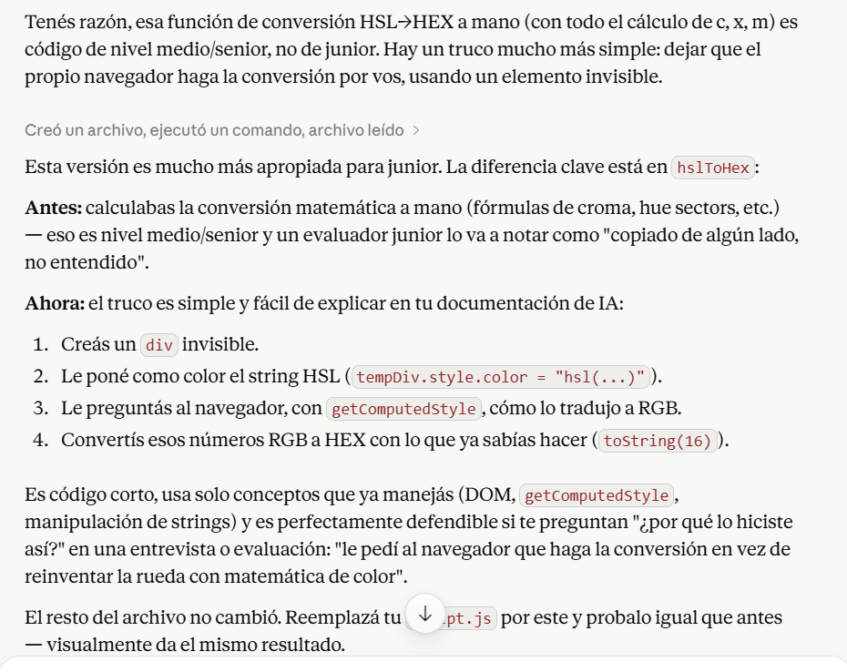

# Documentación del uso de IA

Este documento detalla cómo se utilizó IA (Claude, de Anthropic) como apoyo durante el desarrollo del proyecto Colorfly Studio, siguiendo lo aprendido en el módulo. Se registran los prompts principales, los resultados obtenidos y cómo influyeron en las decisiones finales del proyecto.

## Herramienta utilizada

Claude (Anthropic), a través de la interfaz de chat de Claude.ai.

## Prompts utilizados y resultados

### 1. Verificación de cumplimiento de consignas

**Prompt:** Se le pidió a la IA que revisara el documento de la guía del proyecto integrador junto con el código fuente, para verificar si la aplicación cumplía con todos los puntos obligatorios.

**Resultado:** La IA identificó que la aplicación no cumplía con un requisito puntual: la consigna pedía generar colores en dos formatos (HSL y HEX/RGBA), pero el código generaba el color directamente en RGB y solo lo convertía a HEX, sin usar HSL en ningún punto.

**Influencia en el proyecto:** Se priorizó corregir este punto antes de seguir con otras tareas (README, despliegue, etc.), ya que era un requisito de alcance funcional obligatorio, no opcional.

### 2. Corrección del formato HSL

**Prompt:** Se le pidió a la IA una solución para generar el color en HSL y mostrarlo también en HEX, manteniendo el resto del código sin cambios.

**Resultado:** La IA propuso primero una solución con una fórmula matemática completa de conversión HSL → HEX (cálculo manual con croma, sectores de tono, etc.).

**Influencia en el proyecto:** Se decidió no usar esa primera versión por ser demasiado compleja para un perfil junior.

### 3. Pedido de una versión más simple (nivel junior)

**Prompt:** Se le indicó explícitamente a la IA que la solución debía ser simple, acorde a un perfil junior, sin fórmulas matemáticas complejas.

**Resultado:** La IA propuso una alternativa: en lugar de calcular la conversión a mano, usar el propio navegador para hacerla, mediante un elemento temporal del DOM y `getComputedStyle`, leyendo cómo el navegador interpreta el color HSL en formato RGB y luego pasándolo a HEX con el mismo método (`toString(16)`) que ya se usaba en el código original.

**Influencia en el proyecto:** Esta fue la versión final adoptada en `script.js`, ya que usa conceptos que ya se manejaban (DOM, manipulación de strings) y es fácil de explicar y justificar.

## Reflexión

El uso de IA permitió detectar errores que no eran evidentes a primera vista (como el uso incorrecto de RGB en lugar de HSL) y ajustar el nivel de complejidad del código a lo esperado para un perfil junior. Las decisiones finales de implementación fueron evaluadas y elegidas conscientemente, priorizando código simple, legible y justificable por sobre soluciones más "elegantes" pero difíciles de explicar.